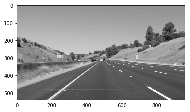

# **Finding Lane Lines on the Road**

Overview
---

When we drive, we use our eyes to decide where to go.  The lines on the road that show us where the lanes are act as our constant reference for where to steer the vehicle.  Naturally, one of the first things we would like to do in developing a self-driving car is to automatically detect lane lines using an algorithm.

The goals / steps of this project are the following:
* Make a pipeline that finds lane lines on the road
* Reflect on your work in a written report

[//]: # (Image References)

[image1]: ./examples/grayscale.jpg "Grayscale"

---

### Reflection

### 1. Describe your pipeline. As part of the description, explain how you modified the draw_lines() function.

My pipeline consist of 7 steps. Firstly, image converted to grayscale, then apply gaussian_blur function for gaussian smoothing. Next stange was to do edge detection using opencv canny function. Then output feeded into region_of_interest method to filter the region for processing.

Next step is to input the canny image to hough_lines method and output will be list of line segments.

![alt text][houghlines]

![alt text][blank image]

As you can see on the above image, left lines are not connected. This can be done by averaging the position of each of
the lines and extrapolate to the top and bottom of the lane. And result will be as follows

![alt text][final blank bimage]

For averaging and extrapolating functionality, I created a function called draw_left_right_lanes which takes a blank placeholder input, actual image, hough lines, color, and thickness of the lines need to be drawn as input. There are two tasks for this function. one is for seperating into left ang right lanes and averaging both seperately.The left lane should have a positive slope, and the right lane should have a negative slope. Therefore, we will collect positive slope lines and negative slope lines separately and take averages. This is done by averaging_lane_lines. Second task is to findout starting and ending points for left and right lanes to draw the lines.

Finally weighted_img function to combine the line drawn and actual image.

![alt text][final image]

### 2. Identify potential shortcomings with your current pipeline

1. One potettial shortcoming is it only detects the straight lane lines. It failure to perform well with curved lines.

2. Another potential issue is that it won't work for steep roads scenario because the region of interest mask is assumed from the center of the image.

### 3. Suggest possible improvements to your pipeline

1. As per the current algorithm, it only detects straight lines. I need to consider poly fitting lane lines rather than fitting to straight lines
