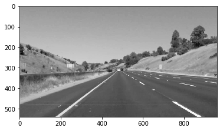
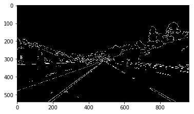
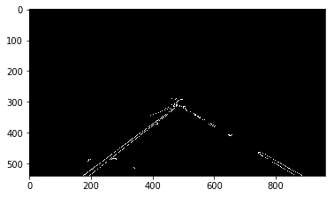
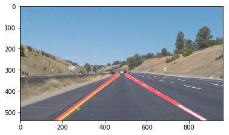

# **Finding Lane Lines on the Road**
[](http://www.udacity.com/drive)


Overview
---

When we drive, we use our eyes to decide where to go.  The lines on the road that show us where the lanes are act as our constant reference for where to steer the vehicle.  Naturally, one of the first things we would like to do in developing a self-driving car is to automatically detect lane lines using an algorithm.

The goals / steps of this project are the following:
* Make a pipeline that finds lane lines on the road
* Reflect on your work in a written report


---

### Reflection

### 1. Describe your pipeline. As part of the description, explain how you modified the draw_lines() function.

My pipeline consist of 7 steps.

```
def pipeline(img, vertices, kernel_size = 3, low_threshold = 40, high_threshold =100, rho = 2, threshold = 50, min_line_length = 10, max_line_gap = 20):
    gray_image = grayscale(img)
    blur_gray_image = gaussian_blur(gray_image, 5)

    #Edge detection using canny algorithm
    canny_image = canny(blur_gray_image, low_threshold, high_threshold)

    #finding region for prcessing
    masked_canny_image = region_of_interest(canny_image, vertices)

    # Define the Hough transform parameters
    theta = np.pi/180 # angular resolution in radians of the Hough grid

    #Hough lines
    lines = hough_lines(masked_canny_image, rho, theta, threshold, min_line_length, max_line_gap)

    #Blank image to draw the lines
    line_img = np.zeros((img.shape[0], img.shape[1], kernel_size), dtype=np.uint8)

    #Draw left and right images
    draw_left_right_lanes(lines, line_img, img, [255, 0, 0], 15)

    # Display the image
    plt.imshow(line_img, cmap='Greys_r')

    #combine the images
    final_image = weighted_img(line_img, img, 1.0, .95, 0.0)

    return final_image

```


Firstly, image converted to grayscale, then apply gaussian_blur function for gaussian smoothing. Next stange is to do edge detection using opencv canny function. Then output feeded into region_of_interest method to filter the region for processing.

Grayscale:



Canny:



Region of Interest:




Next step is to input the canny image to hough_lines method and output will be list of line segments.


For averaging and extrapolating functionality, I created a function called draw_left_right_lanes which takes a blank placeholder input, actual image, hough lines, color, and thickness of the lines need to be drawn as input. There are two tasks for this function. one is for seperating into left ang right lanes and averaging both seperately.The left lane should have a positive slope, and the right lane should have a negative slope. Therefore, we will collect positive slope lines and negative slope lines separately and take averages. This is done by averaging_lane_lines. Second task is to findout starting and ending points for left and right lanes to draw the lines.

```
def draw_left_right_lanes(lines, line_img, actual_img, color, thickness):
    left_lane, right_lane = averaging_lane_lines(lines)
    #left lane
    XY1, XY2 = find_line_points(left_lane, actual_img)
    draw_lines(line_img, XY1, XY2, color, thickness)

    #right lane
    XY1,XY2 = find_line_points(right_lane, actual_img)
    draw_lines(line_img, XY1, XY2, color, thickness)

```

avergaing method:

```
def averaging_lane_lines(lines):
    ll = []
    lw = []
    rl = []
    rw = []
    for line in lines:
        for x1,y1,x2,y2 in line:
            if x2==x1:
                continue
            slope = (y2-y1)/(x2-x1)
            intercept = y1 - slope*x1
            length = np.sqrt((y2-y1)**2+(x2-x1)**2)
            if slope < 0:
                ll.append((slope, intercept))
                lw.append((length))
            else:
                rl.append((slope, intercept))
                rw.append((length))
    left_lane  = np.dot(lw, ll) /np.sum(lw)
    right_lane = np.dot(rw, rl)/np.sum(rw)
    return left_lane, right_lane
```

Finding starting and ending points for the lines to be drawn

```
def find_line_points(line, actual_img):
    slope, intercept = line
    y1 = actual_img.shape[0] #bottom
    y2 = y1*0.6 #middle point

    #finding starting and end line points
    x1 = int((y1 - intercept)/slope)
    x2 = int((y2 - intercept)/slope)
    y1 = int(y1)
    y2 = int(y2)

    return ((x1, y1), (x2, y2))
```


Finally weighted_img function to combine the line drawn and actual image.




### 2. Identify potential shortcomings with your current pipeline

1. One potettial shortcoming is it only detects the straight lane lines. It failure to perform well with curved lines.

2. Another potential issue is that it won't work for steep roads scenario because the region of interest mask is assumed from the center of the image.


### 3. Suggest possible improvements to your pipeline

1. As per the current algorithm, it only detects straight lines. I need to consider poly fitting lane lines rather than fitting to straight lines
